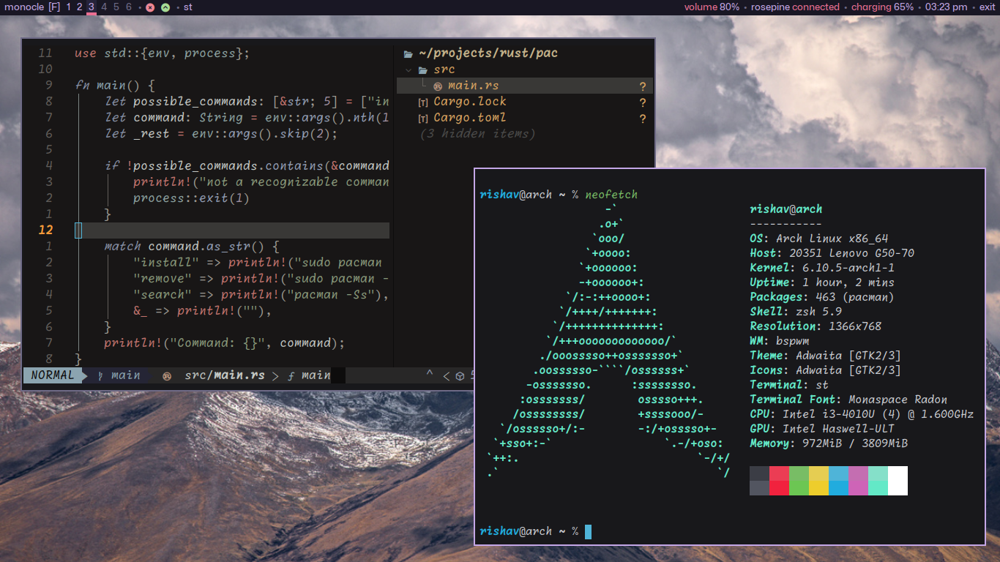

# My personal config files for minimal Arch Linux setup



### Packages I use for
- **WM** bspwm
- **Terminal** st
- **Shell** zsh
- **Status bar** polybar
- **Fonts** Monaspace (sans and mono)

I don't use a login/display manager. The command I use is `startx` provided by `xorg-xinit` package.

### Install the packages
Assuming you have just installed fresh Arch Linux with no DE/WM installed, you may install the following packages.

```console
# pacman -S --needed bspwm sxhkd polybar dunst feh gnome-{keyring,screenshot} xf86-input-synaptics ttf-mona-sans otf-monaspace ttf-nerd-fonts-symbols-mono xorg-{server,xsetroot,xinit}
```

**Additional fonts**
These fonts are not required to install for the GUI setup but are great to 'install and forget' for various language support.

Noto fonts have a great set of almost all languages and emojis.

```console
# pacman -S --needed noto-fonts{,-cjk,-emoji,-extra}
```

**Networking**
I use `connman` with `iwd` however you may want to use your preferred setup. The most straight forward is `networkmanager`. Here are the following to install and setup either one of them.

- Installing **connman** with **iwd**

```console
# pacman -S connman iwd
```

> You may omit `iwd` and install `wpa_supplicant`. For `iwd`, you need to enable it and connect to your wifi with it.

**Enable both systemd services**

```console
$ systemctl enable --now connman iwd
```

**Configuring iwd**
```shell
iwctl device list # for wifi it is usually starts with `wl`
# for my computer, it is `wlan0`
iwctl station wlan0 scan
iwctl station wlan0 get-networks
iwctl station wlan0 connect <SSID> # replace this with your wifi name
# then it will ask you for the wifi password, and done
```

- Installing **NetworkManager** with **wpa_supplicant**
`wpa_supplicant` will be auto-installed as a dependency for NetworkManager.

```console
# pacman -S --needed networkmanager
$ systemctl enable --now NetworkManager
```

**Connect to wifi**
```shell
nmtui-connect
```

Select the network/wifi name and connect.

**Change default shell**
Though it is not required, I use zsh as my default shell for `user`. For `root user` it is default to bash.

I use `zsh` with some additional plugins, install them with pacman.

```console
# pacman -S --needed zsh zsh-{autosuggestions,completions,history-substring-search,syntax-highlighting}
```

### Use a secret manager store
I use `gnome-keyring` to store secrets/passwords.

```console
# pacman -S --needed gnome-keyring polkit-gnome seahorse
```

**Start gnome-keyring on login**
`gnome-keyring` can store passwords and is needed by some applications. To start gnome-keyring on login, add the following in `/etc/pam.d/login` at the bottom.

```shell
auth       optional     pam_gnome_keyring.so
session    optional     pam_gnome_keyring.so auto_start
```

You may also use `gnome-keyring` to store git credentials.

```console
$ git config --global credential.helper /usr/lib/git-core/git-credential-libsecret
```
